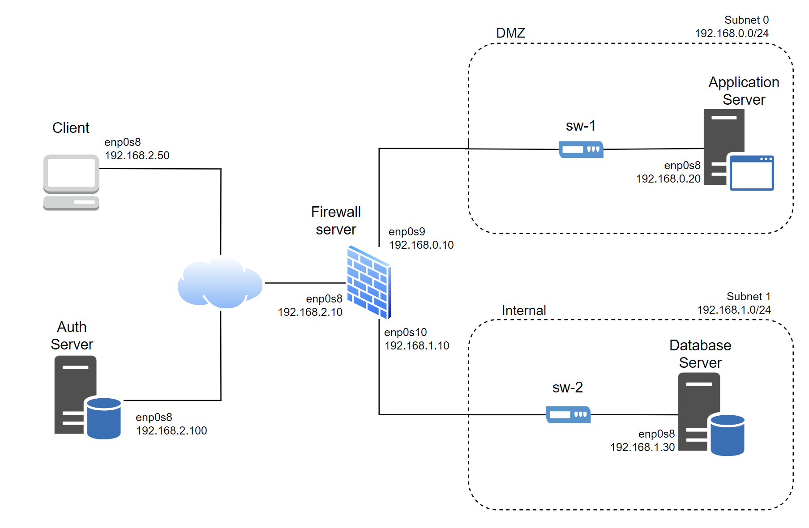

# A31 MediTrack Project Read Me

## Team

| Number | Name              | User                             | E-mail                              |
| -------|-------------------|----------------------------------| ------------------------------------|
| 108444  | Tilde Eriksen Eine     | <https://github.com/tildeeine>   | <mailto:tilde.eine@tecnico.ulisboa.pt>   |
| 96392  | Guilherme Luís Francisco Soares      | <https://github.com/guilhas07>     | <mailto:guilherme.luis.s@tecnico.ulisboa.pt>     |

   

## Contents

This repository contains documentation and source code for the *Network and Computer Security (SIRS)* project.

The [REPORT](REPORT.md) document provides a detailed overview of the key technical decisions and various components of the implemented project.
It offers insights into the rationale behind these choices, the project's architecture, and the impact of these decisions on the overall functionality and performance of the system.

This document presents installation and demonstration instructions.

## Installation

To see the project in action, it is necessary to set up a virtual environment, with 5 machines, one DMZ and one internal network, and a third network that simulates an external network, or running over the internet.   

The following diagram shows the networks and machines:



All the virtual machines are based on: Ubuntu 64-bit.

We chose to use Vagrant to automate the setup of our machines and infrastructure as much as possible. The following instructions will therefore be focused on how to set up vagrant. 

### Prerequisites

Before you begin, ensure you have the following software installed on your machine:
- [Vagrant](https://www.vagrantup.com/downloads) - Download and install Vagrant.
- [VirtualBox](https://www.virtualbox.org/wiki/Downloads) - Download and install VirtualBox.

### Machine configurations

For each machine, there is an initialization script with the machine name, with prefix `init-` and suffix `.sh`, that you can find in the [init-scripts folder](./vagrant/init-scripts/). These scripts, combined with the shell scripts in the Vagrantfile, install all the necessary packages and make all the required configurations in a clean machine.

Here, we will first give instructions for setting up Vagrant, before we explain the content of each machine, and give commands to verify and test the setup for each  machine. To access the machines after they have been set up, you have to use Vagrant SSH.  

#### Vagrant setup
1. **Clone and open the repository**
    On your host machine, run these commands to clone and open the repository:
   ```bash
   git clone https://github.com/tecnico-sec/a31-tilde-david-guilherme.git
   cd a31-tilde-david-guilherme
   ```
2. **Navigate the to Vagrant folder**  
    ```
    cd vagrant
    ```
3. **Start the Vagrant environment**
   ```bash
   vagrant up
   ```
   Make sure you are in the `Vagrant` directory when you run this command. 

   Running this command may take a while, so just wait while Vagrant downloads the base boxes and provisions the VMs. 
4. **Access the VMs**
   
    After Vagrant finishes provisioning the VMs, you can access individual VMs using vagrant SSH:

    ```
    vagrant ssh <name of VM>
    ```
    Replace `name of VM` with the specific VM you want to access. The VMs set up for this project are:
    | Machine               | Name of VM     |
    | --------------------- | -------------- |
    | Client machine        | client_machine |
    | Application server    | app_server     |
    | Database server       | db_server      |
    | Authentication server | auth_server    |
    | Firewall server       | fw_server      |

    You should now be able to access the VMs. 
5. To run the application from the client machine, you need to run the application server and authentication server programs on those machines. To do this, open two tabs in a terminal, and navigate to the folder of this project. Now, for each of the machines, ssh into the machine and then start running the project:
    For the app_server
    ```
    vagrant ssh app_server
    ```
    Once the SSH session is established, run the program
    
    ```
    sudo dotnet run --project /MediTrack/MediTrackBackend/
    ```
    Let this terminal continue to run in the background. 

    Now, do the same for the auth server:
    
    ```
    vagrant ssh auth_server
    ```
    After the SSH session is established, run:
    
    ```
    sudo dotnet run --project /MediTrack/AuthServer/
    ```
6. Now, you can start running the project from the client. SSH into the client machine, and run 
    
    ```
    cd /MediTrack/Client/
    ```
    
    
    

When you are done and want to stop running the VMs, you can use halt:
```sh
vagrant halt
```
To remove the VMs permanently and clean up, use:
```sh
vagrant destroy -f
```
**Note:** This will permanently delete the VMs and their data.

#### Application Server

This machine runs the main functionality of the MediTrack system, by running the backend and exposing a CLI API to clients. It runs the MediTrackBackend code, using the CryptoLib. It should be able to communicate with clients and the database over TLS/SSL. 

**Verify Setup:**

**Vagrant**
```sh
vagrant ssh app_server
```
This command will log you into the application server VM. After executing this command, you should be inside the VM, and the command prompt should reflect that, as you should see the user as `vagrant@a31-MediTrack-app-server:~$`.

**Dotnet**
```sh
dotnet --version
```
This command checks if the .NET runtime is installed. You should see the version of .NET installed without any errors.

**To test:**

Check that you can run the AppServer program:
```sh
/AppServerApp/AppServer
```

Check that the ip address for the interface has been set up correctly:
```sh
ip addr show enp0s8
```
This command displays the network configurations for the VM. The provisioning script should set up the enp0s8 interface with the IP address `192.168.0.20`. 

#### Firewall Server

The firewall server is an important part of securing the application and database servers in our system, and ensuring correct communication between different components in the MediTrack system. It manages network traffic, controls access, and ensures that data exchanges follow predefined rules. Below are instructions for verifying and testing the setup of the firewall server. 

**To verify:**
**Vagrant**

```sh
vagrant ssh fw_server
```
This command logs you into the firewall server VM. After executing this command, you should be inside the VM, and the command prompt should reflect that, as you should see the user as `vagrant@a31-MediTrack-fw-server:~$`.

**Iptables persistent**
```sh
iptables-persistent --version
```
This command checks if iptables-persistent is installed. This is important for the firewall and NAT rules that we set up with iptables-persistent to be persistent between boots of the VM. You should see the version of iptables-persistent installed during the Vagrant provisioning. Since this installation requires answers to user prompts, there might be issues during the installation, even though we use debconf in the Vagrant provisioning. If you don't have iptables-persistent on your macine, please run the following command to install it:

```sh
sudo apt install iptables-persistent
```
Answer yes to the prompts. This should automatically save the current iptables setup, so the rules that were declared in the [firewall initialization script](/vagrant/init-scripts/init-fw-server.sh). 

**Test setup:**
Still using SSH to access the firewall machine, run the following commands to test the setup. 

```sh
sudo iptables -L -n
```
This command shows you the current iptables setup. (INSERT WHAT TABLE SHOULD LOOK LIKE HERE)

```sh
ip addr show enp0s8
ip addr show enp0s9
ip addr show enp0s10
```
These commands display the network configurations for the different interfaces we set up for the VM. The provisioning script should set up the enp0s9 interface with the IP address `192.168.0.10`, enp0s10 interface as `192.168.1.10`, and the enp0s8 interface with the address `192.168.2.10`.

#### Database Server

The database server is responsible for hosting the MySQL database used by the MediTrack system. It is essential for storing and managing data, and should only communicate with the application server, through the firewall. 

**Verify setup:**
**Vagrant**
```sh
vagrant ssh db_server
```
This command logs you into the database server VM. After executing this command, you should be inside the VM, and the command prompt should reflect that, as you should see the user as `vagrant@a31-MediTrack-db-server:~$`.

**MySQL**

```
mysql --version
```
This command checks if MySQL is installed. You should see the version of MySQL installed without any errors.

**Test setup:**

First, check that the dummy database content for demonstration purposes has been set up as intended. 

```sh
sudo mysql -mysql -p'1234' --database='meditrack'
```
This should log you in to MySQL. To check the database, run the following commands:

```sql
use meditrack;
show tables;
```
You should now see the three tables Patients, Consultation and __EFMigrationsHistory. Verify that all of these contain data by running:

```sql
SELECT * FROM Patients;
SELECT * FROM Consultation;
SELECT * FROM __EFMigrationsHistory;
```
When you have verified that all of these contain data, you can exit MySql by writing

```sql
exit;
```
If you have any issues with the database or missing data, you can try importing the data again by running the following command:

```sh
mysql -umysql -p'1234' --database='meditrack' < /MediTrack/MediTrackBackend/Migrations/init.sql
```

Next, we verify the IP setup by running:
```sh
ip addr show enp0s8
```
This command displays the network configurations for the VM. The provisioning script should set up the enp0s8 interface with the IP address `192.168.1.30`.

#### Authentication Server
The authentication server is an important part of ensuring the security of the system. It is used to verify the signatures and encryption used in the other components of the system. 

**Vagrant**
```sh
vagrant ssh auth_server
```
This command logs you into the database server VM. After executing this command, you should be inside the VM, and the command prompt should reflect that, as you should see the user as `vagrant@a31-MediTrack-auth-server:~$`.

**Dotnet**

```sh
dotnet --version
```
This command checks if the .NET runtime is installed. You should see the version of .NET installed without any errors.

**Testing**

Check that you can run the AppServer program:
```sh
/AppServerApp/AppServer
```

Verify that the network configurations for the IP were set up correctly:
```sh
ip addr show enp0s8
```

#### Client machine

This machine server as a client in the MediTrack system. The client can interact with the application server to securely access patient data. The machine runs the client-side code, which runs a CLI interface for the MediTrack program. 

**Verify setup:**

**Vagrant**

```sh
vagrant ssh client_machine
```
You should be able to SSH into the machine without issues. After executing the command, you should be inside the VM, and the command prompt should have the user `vagrant@a31-MediTrack-client-machine`

**Dotnet**

```sh
dotnet --version
```
This command checks if the .NET runtime is installed. You should see the version of .NET installed without any errors. 

**Test setup:**

The client can be considered the last entity to connect to the network, as it is connected every time a patient or a physician wants to perform a task. You should therefore verify that all other machines in the system are up and running as intended before testing this machine. 

Make sure you are running the Application server and Authentication server programs on the app server and auth server machines. 

To verify that everything is working as intended, you can run the following command to log in as one of the test doctors, with identity 00000000:

```
dotnet run start doctor 000000000 /MediTrack/keys/Bob.priv.pem /MediTrack/keys/Bob.pub.pe
```

Verify that the ip was set up as intended:
```sh
ip addr show enp0s8
```
This command displays the network configurations for the VM. The provisioning script should set up the enp0s8 interface with the IP address `192.168.1.30`.

## Demonstration

Now that all the networks and machines are up and running, we can have a look at the actual functionality of the system. 

The main functionality is the patient and the physicians obtaining the relevant EHR's. First, we will show the patient side functionality. 

**The patient wants to log in and get their records**

The patient can log in to the system by providing their keys, as well as their NIF as a unique identifier. 

For the demonstration, we have set up the patient and the doctor to be the same default user, but using the parameter patient logs you in as the patient. Run the following command:

```sh
dotnet run start patient 000000000 /MediTrack/keys/Bob.priv.pem /MediTrack/keys/Bob.pub.pem
```
You should now get an output that shows you the possible commands to run for a patient. The output should look like this:

```
Patient Commands:
    help
    get Get All patient info
    change Changes to doctor mode
```
The `get` command allows a patient to get all their relevant health data. The expected output is as shown below:


You can here see that the patient can see all their medical records decrypted, and that the consultation records contain the physician signature to verify each record. 

**A patient that is also a doctor wants to change modes**

The `change` command exists for doctors who are also registered as patients at the same hospital. this lets them easily change between patient and doctor mode. See the expected output below:

You should now see that the person has changed mode to doctor by the output of possible commands. 

The doctor mode has the equivalent change command that will change them into patient mode if they are registered as patients as well at the hospital. Of course, for the `change` command in both modes, it is only executed if the user is registered as the other mode. 

**A doctor wants to get a patients health records**

To log in as a doctor, you could either use the `change` mode mentioned above if you are a doctor already logged in as a patient, or run the dotnet command but with doctor as a parameter instead of patient: 
```sh
dotnet run start doctor 000000000 /MediTrack/keys/Bob.priv.pem /MediTrack/keys/Bob.pub.pem
```
You should now get the following output, showing the possible commands to execute for a doctor:
```
Doctor Commands:
    help
    get patient-civil-number(NIC) Attempt to get patient info
    emergency patient-civil-number(NIC) Emergency situation, so the physician is able to get all medical records
    change Changes to patient mode
```
To retrieve a patient's health records, the doctor can use the `get` method with the patient's NIC.

The output of this command should be the patients health records, but where only the records that are related to the requesting doctor's speciality are shown in plaintext. The records for other specialities should still be encrypted. The image below shows the expected result for the `get` command:


Here you can see the data shown before and after the doctor encrypts it. Note that only the relevant data for this doctor's specialization is decrypted, as per the controlled sharing functionality. 

**A doctor needs to override the controlled sharing in an emergency**

We also implement an emergency command that allows doctors to override the controlled sharing to get all patient data in an emergency. This can be used by running the `emergency` command with the patients NIC. 

The output of this command should be all of the patients health records, decrypted and readable to the doctor, including the ones unrelated to the doctors specialization. See the expected output below, where Charlie uses the emergency command: 


**The Server encrypts data**

When the server receives a request for some data, it will get the requested data from the datbase, and the use the security library we developed for `secure documents` to protect the data. The following image shows what the data looks like before and after the protection is called. Note that this was shown by adding extra logging commands in the dotnet code, and we don't usually show this data in the CLI. 


**An attacker attempts to impersonate another user**

when starting our application, the client provides the input of the NIF, the users role, and its keys. This is to simulate someone entering the program by using their identity card, containing their keys, and providing their role and NIF. To show that our system performs verification of the keys against the user NIF and role, we show the scenario where an attacker, in this case Bob, is trying to impersonate another user, Charlie, by inputting their NIF number instead of their own. The user will still see the CLI interface, but once they try to actually perform any operations, they will only receive errors, and won't be able to retrieve any useful data. See the expected output for the command below:


As you can see from the image, we get the error message `[Error] Bad Request`. This is the only message the attacker will get, as their keypair is not valid for the NIF they provided. 

**An attacker attempts a replay attack against the system**

As we define in our attacker model, in the [report](./REPORT.md), we assume the attacker is able to eavesdrop and intercept our connection. A common attack for an attacker with these capabilities is to run a replay attack. This means that the attacker has intercepted a previously successfull request, and tries to send this again to get the response sent to themselves. 

However, since our system incorporates freshness, the repeated message is detected and will not be answered by the application server. See the expected output of the attack below:


As you see in the screenshot, the attacker only gets the feedback of `[Error] Bad Request`, and they are not able to use an intercepted message to obtain a legitimate user's data. 


This concludes the demonstration.

## Additional Information

### Links to Used Tools and Libraries

- [C#](https://learn.microsoft.com/en-us/dotnet/csharp/)
- [.NET](https://learn.microsoft.com/en-us/dotnet/)
- [Vagrant](https://www.vagrantup.com/)
- [VirtualBox](https://www.virtualbox.org/)
- [MySQL](https://www.mysql.com/)

### License

This project is licensed under the MIT License - see the [LICENSE.txt](LICENSE.txt) for details.

----
END OF README


