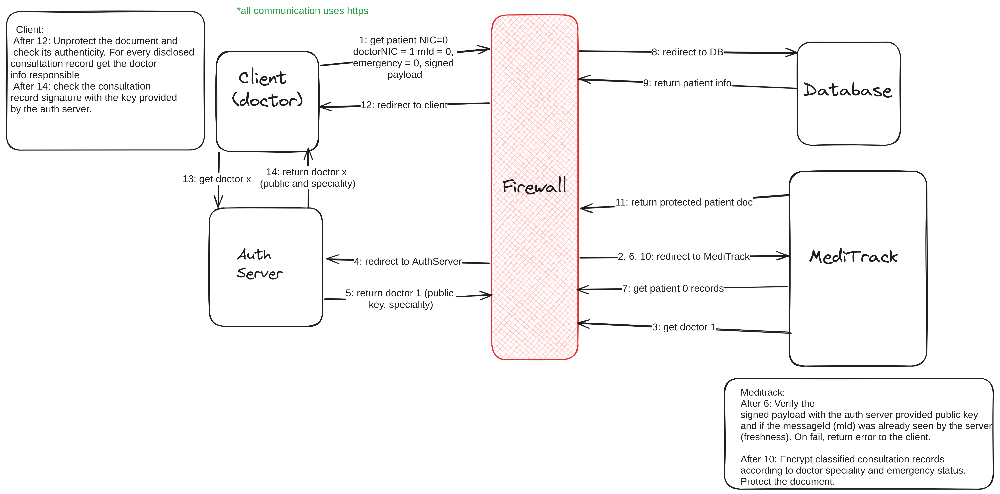

# A31 MediTrack Project Report

## 1. Introduction

Today, more and more services are undergoing a digital transformation, to make use of the benefits in communication and distribution that come with it. Healthcare systems are also a part of this transition, for example through the use of Electronic Health Records (EHR's). These records are used for digitizing patient data management, which makes it easier for healthcare providers to manage the data, and for the broader healthcare services to share patient data between themselves. 
This means MediTrack can greatly enhance health services and facilitate collaboration between healthcare entities. However, healthcare data is very sensitive, and needs to be handled in a way that guarantees the security of the data. 

The first part of the project, secure documents, is about designing and implementing a way to ensure confidentiality and authenticity for the EHR's. This is done through the design and implementation of a custom cryptographic library, [CryptoLib](./src/MediTrack/CryptoLib/CryptoLib.cs). CryptoLib provides essential cryptographic operations such as document protection and sender verification. Through this use of encryption and digital signatures, CryptoLib ensures the confidentiality and authenticity of patient data within the EHR's. 

The second part of the project, infrastructure, is about setting up and configuring servers to support the MediTrack system. This is done through setting up a virtual environment with 5 machines and 3 networks, configuring the interfaces and programs running on each machine, and setting up the firewall and secure TLS/SSL communications for the system. 

The third and final part of the project is the security challenge, where we were introduced to some security challenges to handle for the MediTrack system. These challenges required us to expand our existing solution, as we will describe later in this report. 


## 2. Project Development

### 2.1. Secure Document Format

#### 2.1.1. Design
Our cryptographic library, [CryptoLib](./src/MediTrack/CryptoLib/CryptoLib.cs), was designed to provide the security requirements of the MediTrack Electronic Health Records (EHR) system. The main objectives for this section were to ensure the _authenticity_ and _confidentiality_ of patient data and metadata in the documents. 

We made two key design choices in this phase:
1. **Hybrid Cryptography** - We use a mix of asymmetric and symmetric cryptography to provide confidentiality for the documents through encryption. 

   **Symmetric Cryptography**: We chose symmetric cryptography through AES with CBC-mode to encrypt the content of the documents itself, as symmetric cryptography is more efficient than asymmetric cryptography, and therefore better suited for larger amounts of data. However, we need a safe way to make sure the sender and recipient share this symmetric key. For this key exchange, we use asymmetric cryptography. 
   
    **Asymmetric Cryptography**: A unique symmetric key is generated for each document we call `protect()` on. This key, as well as the CBC-mode Initialization Vector, is then encrypted using the receiver's public key. This allows a safe exchange of keys for each document that is protected. 

2. **Digital signatures** - To provide _authenticity_ for the documents, each document is signed before the encryption step. The user who calls `protect()` provides an authentication key, which is their private key, to sign the document. After the receiver calls `unprotect()` with their private key allowing him to decrypt the data, he then verifies the document authenticity by calling `check()` with the sender's public key.

Before encryption: 
```{
  "patient": {
    "name": "Bob",
    "sex": "Male",
    "dateOfBirth": "2004-05-15",
    "bloodType": "A+",
    "knownAllergies": ["Penicillin"],
    "consultationRecords": [
      {
        "date": "2022-05-15",
        "medicalSpeciality": "Orthopedic",
        "doctorName": "Dr. Smith",
        "practice": "OrthoCare Clinic",
        "treatmentSummary": "Fractured left tibia; cast applied."
      },
      {
        "date": "2023-04-20",
        "medicalSpeciality": "Gastroenterology",
        "doctorName": "Dr. Johnson",
        "practice": "Digestive Health Center",
        "treatmentSummary": "Diagnosed with gastritis; prescribed antacids."
      },
      {
        "date": "2023-09-05",
        "medicalSpeciality": "Dermatology",
        "doctorName": "Dr. Martins",
        "practice": "SkinCare Clinic",
        "treatmentSummary": "Treated for Molluscum Contagiosum; prescribed topical corticosteroids."
      }
    ]
  }
}```
After encryption:
```{
  "patient": {
    "name": "Tn1F4DHsKmLDE/OGpuPDFQ==",
    "sex": "yYCZQlkyAkK4uydiDpP2Nw==",
    "dateOfBirth": "zbB3\u002BRuax8szY\u002BIMGbVr3Q==",
    "bloodType": "rp2no\u002BGhKJBi0xHYYCcVPg==",
    "knownAllergies": [
      "s1SRDyJu7U9VCm0Gq/MIIg=="
    ],
    "consultationRecords": [
      {
        "date": "DRYqKQ6UMcyMftw/qBXWcA==",
        "medicalSpeciality": "ZoYSPlLwEWeARtQO9qPWew==",
        "doctorName": "SO7TMRIWCPbOVdmpmIvRcQ==",
        "practice": "ClhYSrnK45GPtjc9gDjfMpApSGYgk29J0KmK061B4\u002Bc=",
        "treatmentSummary": "9G9qMQgIy/0lzVNKNgIUgH4AsUOUYlInK02f7UQCPTQbUNjYSlt53fr5O4E\u002BMpEi"
      },
      {
        "date": "ddJIlCOBdKsFr1mGFHxV9g==",
        "medicalSpeciality": "EmJ8M7yD6jlp0DHnw3FfsOAymc4ycddw24qos2pHC94=",
        "doctorName": "G/ve/L96ZZu1jxK/feXs3A==",
        "practice": "qLy7jtxDhok9tbWdm/w3fr7zzPry2Al09SKlgScja7Q=",
        "treatmentSummary": "0UU/z4yY/3cHgKi4kUmoeK/1RPXz/3KNwN4nlSBjMb0GqPADbI2Ok8RIjspitzoY"
      },
      {
        "date": "RaBxLoSV/j4Si\u002B6twMROnw==",
        "medicalSpeciality": "BB9IeSzd\u002BqAeE0KV0Judxg==",
        "doctorName": "PygGtQvykeTwb55a2cKdoA==",
        "practice": "a8w04sV/GAfsDoJai3V5Nw==",
        "treatmentSummary": "DzqFsjhY2Q0MX05lGr2PUomza6bmIxsZp\u002B/A9O7TTKhONJMf8FpcjaOprP9y\u002Bfwjv/h1NSVBdJ7OTQEYuhiwgLr7aKmj8ibKKvYTK\u002Bwb6Xc="
      }
    ]
  }
}
```


#### 2.1.2. Implementation

We chose to use C# as our programming language for the implementation of secure documents. This decision was made based on what languages the team were most familiar with, that had support for cryptographic operations. C# does this through the `System.Security.Cryptography` namespace. C# provides a good balance of readability and efficiency, making it good for creating an understandable but efficient cryptographic library. 

The previously mentioned `System.Security.Cryptography` namespace allows us to use built-in cryptographic modules to provide secure documents. Specifically, we use the RSA and AES with CBC modules to provide hybrid encryption, as detailed above. 

In accordance with the project task requirements, our functions were designed as command-line interface (CLI) commands for ease of use. This makes it easy for us to test our commands. 

We faced a few challenges mainly related to the encryption process. One of them lead us to our current document protection design, specifically the mechanism of encrypting/decrypting the document using a shared symmetric key that is shared with assymetric encryption. This design was created when we noticed that asymmetric encryption wasn’t suitible to share large documents in an efficient way. Anoher challenge faced was encrypting only the data that was truly confidential, which means the json values, no matter the json document format. Our current CryptoLib is agnostic to the json document having the capability of providing confidentiality no matter the keys or values. 

### 2.2. Infrastructure

#### 2.2.1. Network and Machine Setup

We chose to use the following setup for our network: 


Our network setup contains two external machines, the client and the authentication server, and a firewall server acting as a bridge between the external and internal networks. The internal networks consist of one DMZ network, where the application server is, and one internal network where we find the database. The application server is the component of our system that ties together the other components to create a functioning MediTrack system.

The setup of our external machines is pretty simple. Each one is running a dotnet program to communicate with the other devices in the system. 

The firewall server runs iptables for firewall configurations and Network Address Translation (NAT). We decided to go with iptables for all the firewall configurations, because it is easy to set up and could be used for both the firewall rules and the NAT rules. We first started using ufw for the rules, because of the simplicity of the program, but had some difficulties combining this with the NAT and therefore decided to move over to all iptables for the firewall server. 

The application server runs the .NET program we developed and contains the main functionality of the secure documents section. We chose to use this technology due to the teams familiarity with #C and the .NET-framework, which provides a robust and scalable environment for the main program. Since this was the framework chosen for the main secure documents functionality, we continued using this for the communicating programs on the client and authentication server as well. 

For the database server, we are using MySQL. Again, this was selected mainly due to the teams familiarity with the system, as well as the widespread use it already has leading to a big community and therefore it is easy to find information on using the system. It is also easy to set up, as well as compatible with our .NET application. 

Finally, we decided to use Vagrant to build and configure this infrastructure. We decided to do this to make the setup and configuration of the infrastructure quick and easy to replicate across different devices. This allowed us to ensure that we all had the exact same setup running across the team, as well as easily destroy and re-build machines if we met issues. However, there were some drawbacks to this approach, mainly connected to our own lack of experience with Vagrant. This created some issues that stole a lot of time from the overall development of the project, as we had to resolve some technical issues with Vagrant. However, we learned a lot from this approach, and think it is overall a good strategy for these types of projects. 

#### 2.2.2. Server Communication Security

Communication security in this system is based mainly on three things
- Encrypting the EHR's, as per the _secure documents_ section
- Use of TLS/SSL for communication between devices
- The firewall server (?)

These three things together work to ensure confidentiality for our system. On top of this, the digital signatures detailed in the section on [secure document design](#211-design) also provide authenticity for the communications. 

The use of both TLS/SSL and encryption of the EHR's works to provide security in layers. Not only is the sensitive content of the health records encrypted, but the communication channel they are transferred over is also encrypted. This adds an extra layer of security. To implement TLS/SSL we generate multiple certificates. One self-signed certificate for the Authentication Server and one self-signed certificate for the MediTrack Server. To ensure confidentiality between the MediTrack Server and the database storing the patient records, we created another certificate placed at the DB signed by the MediTrack Server. This way every time our server makes a DB request, the data will be confidential.

The firewall adds security for the application server and database server through the use of NAT and firewall rules. We set the rules to drop as default, and only allow specific traffic that matches flows we expect to see from the legitimate communications. 

More specifically, we implemented the following firewall and NAT rules for our firewall server iptables configuration:
```sh

sudo iptables -F
sudo iptables -t nat -F
sudo iptables -t nat -A POSTROUTING  -j MASQUERADE

# Set default policies
sudo iptables -P INPUT DROP
sudo iptables -P FORWARD DROP
sudo iptables -P OUTPUT DROP

# Allow SSH connections from vagrant to the firewall server
sudo iptables -A INPUT -p tcp --dport 22 -m state --state NEW,ESTABLISHED -j ACCEPT 
sudo iptables -A OUTPUT -p tcp --sport 22 -m state --state ESTABLISHED -j ACCEPT

# Forward incoming TLS/SSL connections on enp0s8 to app server (EXT -> AS)
sudo iptables -A FORWARD -d 192.168.0.20 -p tcp -m tcp --dport 443 -j ACCEPT
sudo iptables -t nat -A PREROUTING -i enp0s8 -p tcp -m tcp --dport 443 -j DNAT --to-destination 192.168.0.20:443 #:5001

# Allow replies to established connection
sudo iptables -A FORWARD -i enp0s9 -o enp0s8 -m state --state ESTABLISHED -j ACCEPT

# Forward incoming TSL/SSL connections from app with destination db server (AS -> DB)
sudo iptables -A FORWARD -d 192.168.1.30 -p tcp -m tcp --dport 3306 -j ACCEPT
sudo iptables -t nat -A PREROUTING -i enp0s9 -p tcp -m tcp --dport 3306 -j DNAT --to-destination 192.168.1.30:3306


#  Forward requests from DB to App_server
sudo iptables -A FORWARD -i enp0s10 -o enp0s9 -m state --state ESTABLISHED -j ACCEPT 

# Forward outgoing TLS/SSL connections from app server to auth server (AS -> AuthS) #! Only case where app server can initiate a connection
sudo iptables -A FORWARD -d 192.168.2.100 -p tcp -m tcp --dport 5002 -j ACCEPT
sudo iptables -t nat -A PREROUTING -i enp0s9 -p tcp -m tcp --dport 5002 -j DNAT --to-destination 192.168.2.100:5002 #! check ports

# Allow replies to established connection
sudo iptables -A FORWARD -i enp0s8 -o enp0s9 -m state --state ESTABLISHED -j ACCEPT
``` 

**Challenges**

We faced some issues with setting up the firewall rules, as we found it difficult to keep track of which ports and addresses were used when communication arrived at the different interfaces for the firewall. We were also relatively unfamiliar with the use of iptables, so learning the syntax and use cases for the technology was also a big part of the challenge here. 

One such challenge was the result of our use of Vagrant for the system, as we don't build machines that are intended to be used with the GUI. The normal use of Vagrant systems is to SSH into the machines as needed. Therefore, when we first set up the firewall rules, we were unable to connect to the firewall server since the firewall rules didn't allow SSH connections. Because of this, we had to add an iptable rule to allow SSH connections directed at the firewall server, to be able to access it using Vagrant. This access was important for testing the system, as well as for getting the network traces of running the security tests.

**Key distribution**

For this system, we imagined that the private keys for the doctors and the patients would be integrated with their identity cards. The private keys for the different servers are already set up on the servers, which is done during the Vagrant provisioning step. The public keys are all managed by the authentication server, whose purpose is to be a trusted source for public keys. We assume that the authentication server is an external, national server ran by some national authority that updates and secures it. Therefore, we decided to not create a fully secured server for the authentication server, and instead just build a simple external server that demonstrates the same functionality of providing public keys, as well as providing the specializations for doctors. 

For the communication between the client and the server, symmetric keys are exchanged during communication setup, using the public keys provided by the authentication server.

### 2.3. Security Challenge

#### 2.3.1. Challenge Overview

The security challenge for the MediTrack project introduced requirements for:
- Digital signatures by the physician on their consultations
- Controlled sharing, where patients can choose to keep parts of their medical records confidential
- An emergency override for the controlled sharing

The first requirement of digital signatures was already included in our first solution for secure documents, so this didn't require any changes for us. However, we did need a way to keep track of the public keys of physicians to easily verify these signatures. This required us to expand our system by adding an authentication server, to keep track of the public keys. 

For the next part, with controlled sharing, we first had to decide on the scope of the functionality. We landed on making it so that physicians can only access the consultation records that are relevant to their speciality. The other records will be encrypted so that the physician can't read them. Of course, the simplest option here would be to just not send the records that the physician is not intended to have access to. The reason we are sending the inaccessible data as well, but encrypted, is just for demonstration purposes, to show that the controlled sharing is working. We also looked at the alternative of having a symmetric key for each speciality that would be kept for example in the authentication server for all the doctors of this speciality. We could have used this setup, but decided to go with our solution for simplicity, as we only have to expand the database with the physician's speciality. 


The urgency requirement was implemented using a boolean flag. Ideally in the real world, this flag would have to be signed/authorized by an external trusted entity, so the server is sure that it is in fact an emergency.


#### 2.3.2. Attacker Model

**Trust relations:** The database server, application server and authentication server will be fully trusted. These are integral parts of the system, and if any of these were untrusted the system would not function. If the database was untrusted the rest of the system would not make sense, as a central focus is secure distribution of the data stored here. If the authentication server was untrusted our public key cryptosystem would be pointless, and if the application server was untrusted the requests to the database would not be safe, and the entire system would be compromised. Therefore, the only untrusted part of the system is the client. The Client can be either a physician or a patient, and will need to prove their identities. This role is the only one that we assume an attacker could have direct access to. 

**Assumptions about the attacker:** 

The attacker can:
- Eavesdrop and intercept all external communications
    - Client to/from application server communication
    - Application server to/from authentication server communication
- Attempt replay attacks during key distribution, trying to reuse intercepted key exchange data
- Attempt Man-in-the-Middle (MitM) attacks, trying to intercept and alter communication between entities within the system


The attacker can't:
- Get the identity card containing the private key for physicians and patients
- Discover any private keys in useful time
- Obtain a key pair where the public key is signed by our CA

#### 2.3.3. Solution Design and Implementation

As mentioned before, the key distribution raised the necessity of having a way to share all the public keys of the doctors. To do that, we assumed the existence of a national entity with the records of all the doctors in the country. This allows us to retrieve the doctor's info (public key and speciality) in a trusted way. To verify the authenticity of the incoming requests, we established that each request had a payload on the body with the request arguments digitally signed. On arrival, we get the doctor’s info and use the CryptoLib `check()` function to verify the authenticity of the request, proving that it was indeed the doctor who sent the request. 

The flow for a patient request is similar, only differing on the place where we store the patient public key, in this case on our database. This mechanism allowed us to introduce an import security mechanism on our server: `freshness`; to protect against replay attacks. The server keeps message identifiers associated with every client. When making a request the client includes a message identifier on the signed payload, and using a new extended `check()` function on arrival we see if the client already sent that message, in which case we ignore it. 

To implement the controlled sharing we first had to extend the CryptoLib functionality and expose a `sign()` function to digitally sign the consultation records. The digital signature is stored on the database along with all the consultation records and, on a request, it's sent back to the client, so every physician/patient can use the `check()` function and verify its authenticity. Of course, the client is only able to `unprotect()` and `check()` the authenticity of consultation records that he is allowed to see because the remaining ones will be encrypted with a random symmetric key. The emergency mechanism overrides the process of checking the consultation records that the physician has access to, giving him full access to the patient’s records in order to better handle the patient in an urgent situation.




## 3. Conclusion

We were able to create a fully functioning system for securing the EHR’s, complete with digital signatures and using both symmetric and asymmetric cryptography. 

We were also able to set up a functioning infrastructure using vagrant to build and configure our VMs. The infrastructure successfully implements a firewall that implements some security for the external requests going to the DMZ with the application server, and which only allows the application server to communicate through the firewall and to the internal network containing the database.

We successfully set up TLS/SSL to provide secure communications between the client and application server, and the application server and authentication server, using a self-signed CA. We were also able to set up a public key infrastructure that allows us to use asymmetric encryption for setting up the symmetric keys for client-to-application communication, which also provides a way to verify the physician's signatures to ensure the authenticity of the system.  

Finally, we were able to implement the controlled sharing, both as a specialization-based sharing of patient records using our authentication server, and with an emergency override of this encryption by having the option of using an emergency flag. 

Requirements:

**"The protected document must ensure the authenticity and confidentiality of the patient data and metadata"**. We fully satisfy this requirement, as a document that has been protected has been encrypted using AES CBC-mode, and the symmetric key for decrypting this will not be available to anyone other than the client and the intended recipient, ensuring confidentiality. For the authenticity, it is ensured by the public key cryptosystem we use where doctors sign their consultation records. This means that an attacker can't construct a fake consultation record, as they would not be able to generate a valid keypair with a signature, and would not have the private key of any physicians, per our attacker model. 

**"Each consultation record should be digitally signed by the physician in a non-repudiable way"**. We fully satisfy this requirement, as we use a public key infrastructure with the authentication server that contains the public keys for valid keypairs, and we implement the digital signatures. Since it is not possible to validate a fake keypair, the public key infrastructure makes the signatures non-repudiable for the physician. 

One obvious enhancement if we were to continue working on this project or deploy it to be used by patients and physicians would be to make a web interface to make it more user-friendly. Even though we are used to using the terminal at this point, most people are not, and this would be too high of an entry barrier for many users, especially from older generations. 

We would also have to implement some sort of verification of the urgency flag, to ensure that it is not being abused when there is no emergency. A part of extending this functionality could also be to implement some sort of log for who invokes it and when, as well as a notification for patients whenever their records were accessed with the emergency flag. This would help reduce the chances of it being abused. 


To conclude, this project has allowed us to get valuable hands-on experience with deploying a range of different security mechanisms on a computer, and on a network. From developing a custom C# library that can perform fundamental security operations like encryption, decryption, signatures and validation, to designing and building a complete network infrastructure and implementing security functions on this. These practical tasks for the project have forced us to really get to know some of the most basic security mechanisms that are implemented in a network, like implementing a firewall and building a NAT table, as well as setting up certificates and a CA to enable SSL/TLS communications. Having to implement this in a project ourselves has given us a deeper understanding of the course topics and related practical technologies that we would not have gotten from lectures alone. 


## 4. Bibliography

(_Present bibliographic references, with clickable links. Always include at least the authors, title, "where published", and year._)

----
END OF REPORT


